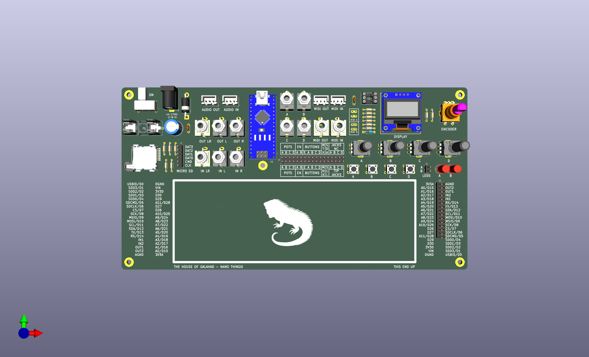

# Prototyping Carrier Board for the Arduino Nano/NanoR4™ 

WIP and Largely Incomplete

[Nano Family Store](https://store.arduino.cc/pages/nano-family)

This PCB is designed to breakout all the PINs of the Arduino Nano and Nano R4 along with additional components such as push buttons, LEDs, potentiometers, I2C, and SD card interfaces along with enough room for a typical 830 point breadboard.  

All 30 Nano PINs are available on both sides of the board with those on the left being mirrored/inverted for additional flexibility.

[Interactive Bill of Materials (BOM)](https://github.com/Desval27/NanoThingie/blob/main/bom/ibom.html)

## Notes:
- Push buttons are connected on one side to GND to be used with input pullup GPIO pins.
- Potentiomenters are prewired on on the CW & CCW sides to +5V and GND.
- JST connectors are provided to breakout the Audio in/out and MIDI in/out signals to external jacks (1/4" Phono, 5-pin DIN, etc.).
- Jumpers are provided to change the configuration between TRS MIDI-A and TRS MIDI-B.  The default configuration is MIDI-A.  If MIDI-B is desired then the jumpers for MIDI-A need to be cut and those for MIDI-B bridged.

## ⚠️ Disclaimer

This project is provided **"as is"**, without warranty of any kind, express or implied,
including but not limited to the warranties of merchantability, fitness for a
particular purpose, and noninfringement.

This is a DIY electronics project intended for educational and experimental use.
Use at your own risk.

The author assumes **no responsibility or liability** for any damage, injury, or loss
resulting from the use or misuse of this design, including but not limited to:

* Damage to connected equipment (Eurorack modules, power supplies, computers, etc.)
* Incorrect assembly or wiring
* Use with incompatible voltages or signal levels
* Personal injury

### Electrical Safety

This project may interface with:

* ±12V Eurorack power rails
* External control voltages (CV)
* Digital and analog circuitry

Improper handling may result in damage or unsafe conditions.

You are responsible for:

* Verifying all connections before powering the system
* Ensuring correct polarity of power connections
* Confirming voltage ranges and signal compatibility
* Using appropriate protection circuits where necessary

### No Guarantees

Schematics, PCB layouts, and code are provided for reference only.
They may contain errors, omissions, or design flaws.

**Always review and validate the design before building or using it.**

